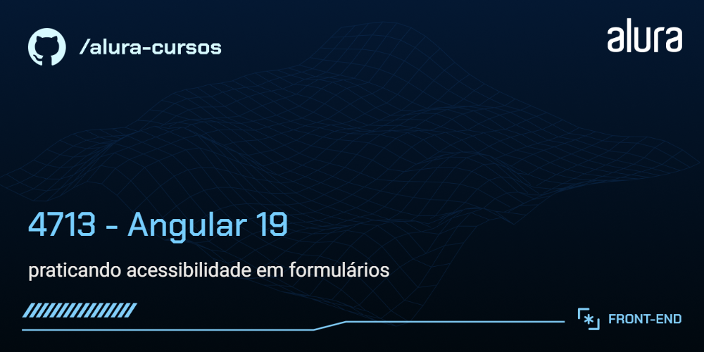

# Indexa

Uma aplicação para manipulação de contatos de uma agenda.

## 🔨 Funcionalidades do projeto

O App lista os contatos, exibindo nome e telefone, de acordo com a letra inicial e possui um filtro interativo. Também é possível adicionar um novo contato.

Possui uma tela de perfil, com detalhes do contato.
Também estão implementadas as funcionalidades de edição e exclusão de contatos utilizando o HttpClient do angular.

## ✔️ Técnicas e tecnologias utilizadas

As técnicas e tecnologias utilizadas pra isso são:

`Angular`: Framework utilizado para construir a aplicação, na versão 19.

`CLI do Angular`: Ferramenta de linha de comando para agilizar a criação e organização do projeto.

`Componentização`: Estrutura modular e reutilizável que define a base da aplicação.

`Diretiva ngClass`: Aplicação de classes CSS dinamicamente para estilização condicional.

`Controle de Fluxo`: Uso de @if e @for para controlar a exibição e iteração de elementos na interface.

`Inputs com Signals`: Comunicação eficiente entre componentes utilizando a API de Signals.

`Injeção de dependências (DI)`: Utilização do sistema de DI do Angular para gerenciar serviços.

`Serviços Angular`: Criação e configuração de serviços injetáveis para separação da lógica de comunicação com a API.

`HttpClient`: Consumo de APIs REST para listar, adicionar, editar e excluir contatos.

`Requisições HTTP`: Implementação das operações GET, POST, PUT, e DELETE para manipulação de dados.

`Observables e RxJS`: Uso do padrão Observer para tratar dados assíncronos e resposta de requisições HTTP.

`JSON Server`: Simulação de um backend para armazenar e gerenciar os dados do projeto.

## 📁 Link do Figma

Você pode [acessar o figma do projeto aqui](https://www.figma.com/community/file/1496573464971288017).

## 🛠️ Abrir e rodar o projeto

Requisitos:

Node.js (versão 18 ou superior).

Angular 19 (caso não tenha, instale com npm install -g @angular/cli@19).

JSON Server (versão 0.17.4)

Após baixar o projeto, você precisa instalar as dependências utilizando o comando:
```bash
npm install
```
Iniciar o backend (JSON Server):
```bash
cd backend
npm start
```

Depois, para executar o projeto em modo desenvolvimento:
```bash
ng serve
```
Então, acesse [http://localhost:4200/](url) no seu navegador.
